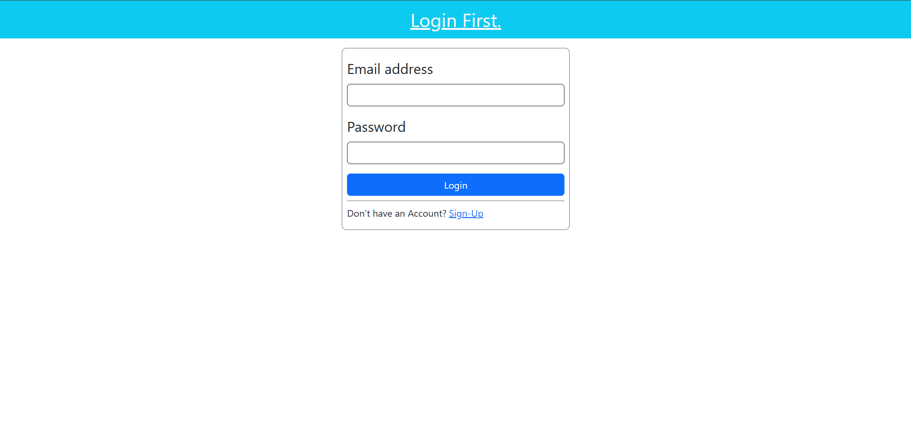

Laravel Authentication and Authorization System

This Laravel project implements a complete Authentication and Authorization system. It includes user registration, login, logout, role-based access control (RBAC), and middleware protection.

##Features

User Registration

User Login & Logout

Password Hashing

Middleware Protection

Role-Based Access Control (RBAC)

Session Management

CSRF Protection

Installation

Prerequisites

Ensure you have the following installed on your system:

PHP (>= 8.0)

Composer

MySQL or any supported database

Authorization System

Role-Based Access Control (RBAC) is implemented.
Middleware is used to restrict access based on roles (admin, user, etc.).

Example middleware usage:

    public function handle(Request $request, Closure $next): Response
    {
        $validAuth = Auth::check();
        if (!$validAuth) {
            return redirect()->route("login");
        }
        return $next($request);
    }

Example gate usage:

    public function boot(): void
    {
        // admin gate
        Gate::define("isAdmin", function (User $user) {
            return $user->role === "admin";
        });

        // author gate
        Gate::define("isAuthor", function (User $user) {
            return $user->role === "author";
        });
    }

##Project Images

Regsiter page

Login Page

Admin Page

User Page
